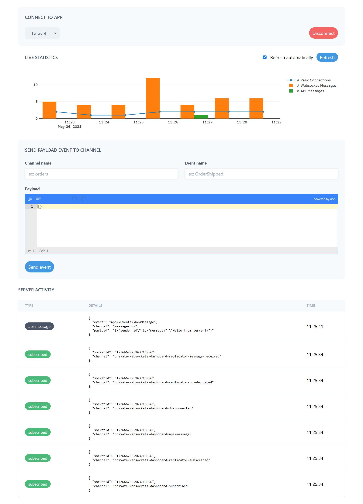
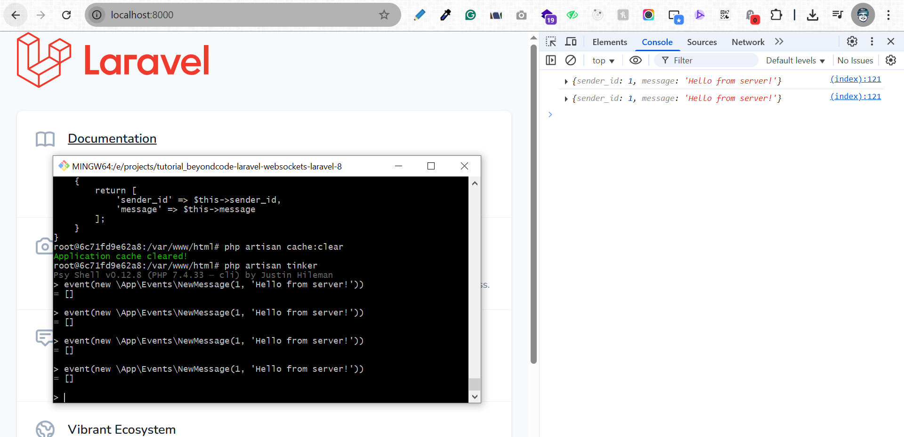
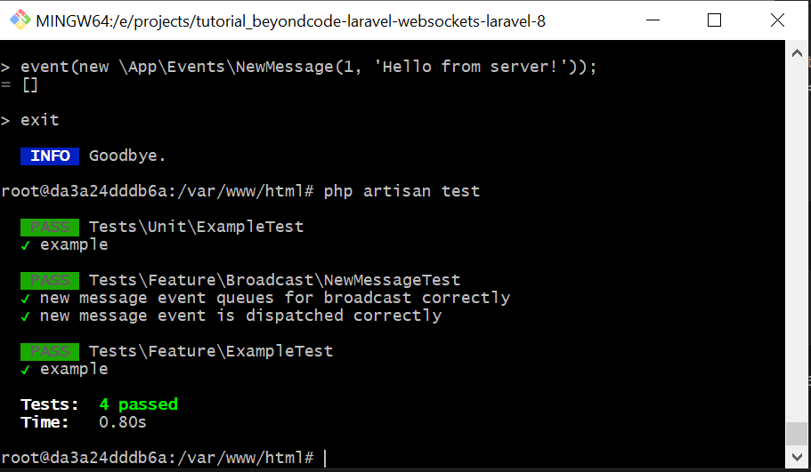
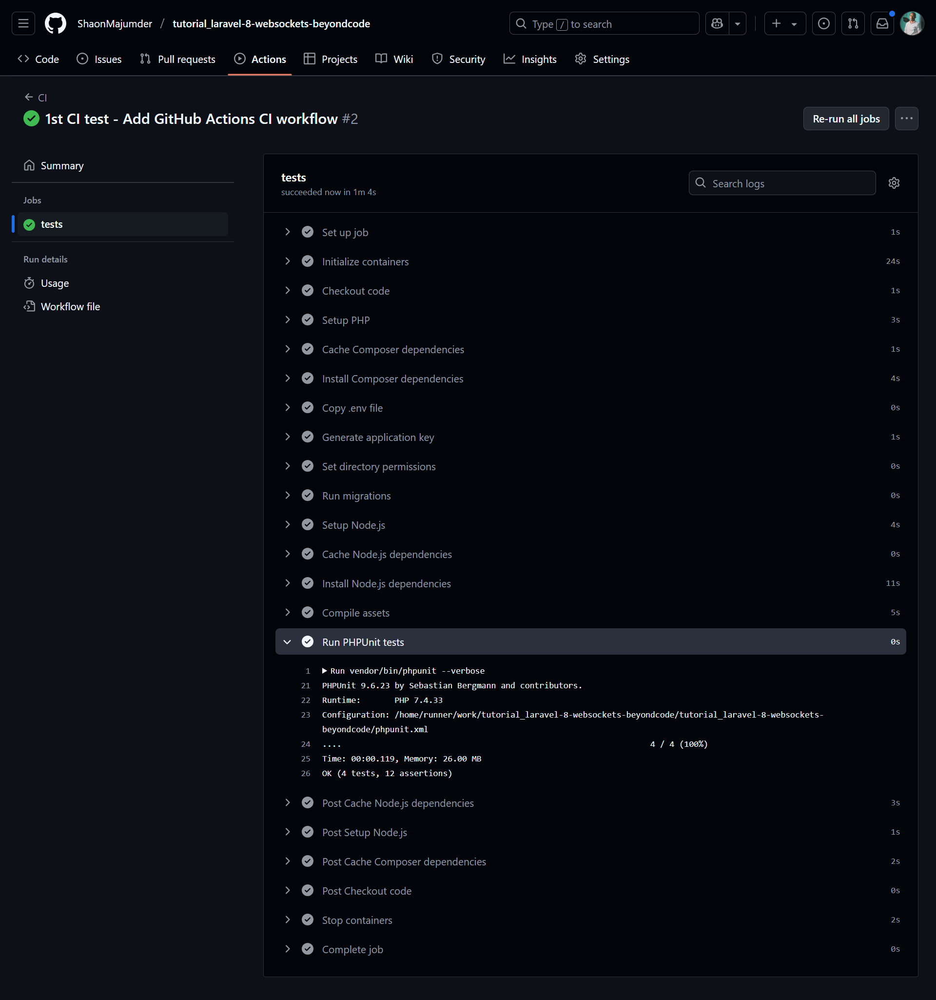

# 🧪 Laravel 8 WebSocket Broadcasting with beyondcode/laravel-websockets

This tutorial guides you through setting up real-time WebSocket broadcasting in a Laravel 8 application using the beyondcode/laravel-websockets package. By the end, you’ll have a fully functional WebSocket server, event broadcasting, and automated tests running in a Dockerized environment.

## 🚀 1. Introduction & Advantages

The beyondcode/laravel-websockets package provides a drop-in replacement for Pusher, enabling real-time communication without relying on third-party services. Key advantages include:

- **Cost-Effective:** Runs on your own server, even a $5 VPS, supporting up to 15,000 concurrent connections (tested by the package creator).
- **Pusher Compatibility:** Seamlessly integrates with Laravel’s broadcasting system and Pusher’s client SDKs.
- **Scalable:** Suitable for small to large-scale applications with minimal configuration.

For scaling details, see the official documentation - https://beyondco.de/docs/laravel-websockets/faq/scaling .

## 📦 2. Clone the Laravel 8 Docker Template

Clone the pre-configured Laravel 8 Docker template to get started:

```bash
git clone https://github.com/ShaonMajumder/docker-template_laravel-8-php-7.4-npm-mysql-redis-nginx tutorial_laravel-8-websockets-beyondcode
cd tutorial_laravel-8-websockets-beyondcode
```
- This template includes PHP 7.4, MySQL, Redis, Nginx, and Node.js, tailored for Laravel and WebSocket support.

## 🛠️ 3. Build and Run Docker Containers
### Configure WebSocket Port
In `docker-compose.yml`, add port `6001` to the `app` service to enable WebSocket communication:

```yaml
services:
  app:
    ports:
      - "6001:6001"
```

### Configure Supervisor for WebSocket Server
Create or update `/docker/supervisord.conf` to run the WebSocket server:
```ini
[program:websockets]
command=php /var/www/html/artisan websockets:serve
autostart=true
autorestart=true
stderr_logfile=/var/log/websockets.err.log
stdout_logfile=/var/log/websockets.out.log
```

### Set Up Environment Variables
Add the following to `environment/.env.local` to configure the Pusher-compatible WebSocket driver:
```ini
BROADCAST_DRIVER=pusher

PUSHER_APP_ID=1234
PUSHER_APP_KEY=asfsdfsdgs
PUSHER_APP_SECRET=sdgdghdggdf
PUSHER_APP_CLUSTER=mt1
PUSHER_SCHEME=http
PUSHER_HOST=127.0.0.1
PUSHER_PORT=6001
```

### Build and Run Containers
Build and start the Docker containers:
```bash
docker-compose --env-file environment/.env.local up --build
```
- if not worked try this command again

## 📦 4. Install Dependencies
Access the `laravel-app` container:
```bash
docker exec -it laravel-app bash
```

Inside the container, install the required packages:
- Install beyondcode/laravel-websockets:
```bash
composer require beyondcode/laravel-websockets
```
- Install pusher-php-server:
```bash
composer require pusher/pusher-php-server:^3.0
```
- Install doctrine/dbal (for schema changes):
```bash
composer require doctrine/dbal
```
### Publish WebSocket Assets
Publish the WebSocket migrations and configuration:
```bash
php artisan vendor:publish --provider="BeyondCode\LaravelWebSockets\WebSocketsServiceProvider" --tag="migrations"
php artisan vendor:publish --provider="BeyondCode\LaravelWebSockets\WebSocketsServiceProvider" --tag="config"
php artisan migrate
```

## ⚙️ 5. Verify Broadcasting Configuration
Ensure `config/broadcasting.php` is configured to use the Pusher driver with WebSocket settings:
```php
    'connections' => [

        'pusher' => [
            'driver' => 'pusher',
            'key' => env('PUSHER_APP_KEY'),
            'secret' => env('PUSHER_APP_SECRET'),
            'app_id' => env('PUSHER_APP_ID'),
            'options' => [
                'cluster' => env('PUSHER_APP_CLUSTER'),
                'useTLS' => env('PUSHER_SCHEME', 'https') === 'https', //true,                
                'host' => env('PUSHER_HOST','127.0.0.1'),
                'port' => env('PUSHER_PORT','6001'),
                'scheme' => env('PUSHER_SCHEME', 'http')
            ],
        ],
```

## ✉️ 6. Create and Dispatch a Broadcast Event
Create a new event for broadcasting:
```bash
php artisan make:event NewMessage
```
Edit `app/Events/NewMessage.php` and update the event to implement `ShouldBroadcastNow` for immediate broadcasting:
```php
<?php

namespace App\Events;

use Illuminate\Broadcasting\Channel;
use Illuminate\Broadcasting\InteractsWithSockets;
use Illuminate\Broadcasting\PresenceChannel;
use Illuminate\Broadcasting\PrivateChannel;
use Illuminate\Contracts\Broadcasting\ShouldBroadcast;
use Illuminate\Foundation\Events\Dispatchable;
use Illuminate\Queue\SerializesModels;
use Illuminate\Contracts\Broadcasting\ShouldBroadcastNow;

class NewMessage implements ShouldBroadcastNow
{
    use Dispatchable, InteractsWithSockets, SerializesModels;

    public $sender_id;
    public $message;

    /**
     * Create a new event instance.
     *
     * @return void
     */
    public function __construct($sender_id, $message)
    {
        $this->sender_id = $sender_id;
        $this->message = $message;
    }

    /**
     * Get the channels the event should broadcast on.
     *
     * @return \Illuminate\Broadcasting\Channel|array
     */
    public function broadcastOn()
    {
        return new Channel('message-box');
    }

    public function broadcastWith()
    {
        return [
            'sender_id' => $this->sender_id,
            'message' => $this->message,
        ];
    }
}
```

### Test Event Broadcasting
Visit http://localhost:8000/laravel-websockets in your browser.
Press `Connect` Button.

Access the container and open Laravel Tinker:
```bash
docker exec -it laravel-app bash
php artisan tinker
```

Trigger the event:
```php
event(new \App\Events\NewMessage(1, 'Hello from server!'));
```
Expected output: [] (indicating success).

### Verify WebSocket Dashboard
Go to tab http://localhost:8000/laravel-websockets in your browser. You should see the broadcasted event:
```json
{
  "event": "App\\Events\\NewMessage",
  "channel": "message-box",
  "payload": "{\"sender_id\":1,\"message\":\"Hello from server!\"}"
}
```

- If the event appears, the backend WebSocket setup is working correctly.

## 📦 7. Install Frontend Dependencies (Vite)
Install Node.js dependencies for the frontend:

```bash
npm install
npm install laravel-echo pusher-js
```

## 💡 8. Configure Frontend Listener
Edit `resources/js/bootstrap.js` to set up Laravel Echo for WebSocket communication:
```js
import Echo from 'laravel-echo';

window.Pusher = require('pusher-js');

window.Echo = new Echo({
    broadcaster: 'pusher',
    key: process.env.MIX_PUSHER_APP_KEY,
    cluster: process.env.MIX_PUSHER_APP_CLUSTER,
    forceTLS: false,
    wsHost: window.location.hostname,
    wsPort: process.env.PUSHER_PORT | '6001',
    disableStats: true,
    enabledTransports: ['ws', 'wss'],
});
```
Build js assets:
```bash
npm run dev
```

Update `resources/views/welcome.blade.php` by adding the following before the closing </body> tag:
```blade
....
        <script src="{{ asset('js/app.js') }}"></script>
        <script>
            window.Echo.channel('message-box').listen('NewMessage', (data) => {
                console.log(data)
            })
        </script>
    </body>
```

### Test Frontend Integration
Open http://localhost:8000 in your browser and open the console (F12).

In the container, run Tinker:
```bash
docker exec -it laravel-app bash
php artisan tinker
```
shell will appear like this:
```bash
Psy Shell v0.12.8 (PHP 8.3.21 — cli) by Justin Hileman
>
```
Now, Trigger the event:
```bash
event(new \App\Events\NewMessage(1, 'Hello from server!'));
```
- output: [] - if '[]' , then it is ok.

Now parallely visit at http://localhost:8000, open console, at once trigger event 

- Expected output in the browser console:
```json
{ sender_id: 1, message: "Hello from server!" }
```
If the message appears, the frontend WebSocket listener is working.

## ✅ 9. Create Unit Tests
Generate a test case for the NewMessage event:
```bash
php artisan make:test Broadcast/NewMessageTest
```
Edit `tests/Feature/Broadcast/NewMessageTest.php` to verify event broadcasting and dispatching:
```php
<?php

namespace Tests\Feature\Broadcast;

use Illuminate\Foundation\Testing\RefreshDatabase;
use Illuminate\Foundation\Testing\WithFaker;
use Tests\TestCase;
use App\Events\NewMessage;
use Illuminate\Support\Facades\Event;
use Illuminate\Support\Facades\Broadcast;

class NewMessageTest extends TestCase
{
    /**
     * A basic feature test example.
     *
     * @return void
     */
    // public function test_example()
    // {
    //     $response = $this->get('/');

    //     $response->assertStatus(200);
    // }

    public function test_new_message_event_queues_for_broadcast_correctly()
    {
        Broadcast::shouldReceive('queue')->once()->andReturnUsing(function ($event) {
            $this->assertInstanceOf(NewMessage::class, $event);
            $this->assertEquals('message-box', $event->broadcastOn()->name);
            $this->assertEquals([
                'sender_id' => 1,
                'message' => 'Hello from server!',
            ], $event->broadcastWith());
        });

        event(new NewMessage(1, 'Hello from server!'));

        $this->assertTrue(true);
    }

    public function test_new_message_event_is_dispatched_correctly()
    {
        Event::fake([NewMessage::class]);

        event(new NewMessage(1, 'Unit test message'));

        Event::assertDispatched(NewMessage::class, function ($event) {
            $this->assertEquals('message-box', $event->broadcastOn()->name);
            $this->assertEquals(1, $event->broadcastWith()['sender_id']);
            $this->assertEquals('Unit test message', $event->broadcastWith()['message']);
            $this->assertEquals(['sender_id' => 1, 'message' => 'Unit test message'], $event->broadcastWith());
            return $event->sender_id === 1 &&
                $event->message === 'Unit test message' &&
                $event->broadcastOn()->name === 'message-box';
        });
    }
}
```
Run tests:

```bash
php artisan test
```

Tests should pass confirming the event is properly configured and broadcastable.


## 🤖 12. GitHub Actions CI Setup

### Create `.github/workflows/ci.yml`:
```yaml
name: CI

on:
  push:
    branches: [ main ]
  pull_request:
    branches: [ main ]

jobs:
  tests:
    runs-on: ubuntu-latest

    services:
      mysql:
        image: mysql:5.7
        env:
          MYSQL_ROOT_PASSWORD: root
          MYSQL_DATABASE: laravel
          MYSQL_USER: laravel
          MYSQL_PASSWORD: laravel
        ports:
          - 3306:3306
        options: --health-cmd="mysqladmin ping" --health-interval=10s --health-timeout=5s --health-retries=3

      redis:
        image: redis:alpine
        ports:
          - 6379:6379
        options: --health-cmd="redis-cli ping" --health-interval=10s --health-timeout=5s --health-retries=3

    steps:
      - name: Checkout code
        uses: actions/checkout@v4

      - name: Setup PHP
        uses: shivammathur/setup-php@v2
        with:
          php-version: '7.4'
          extensions: pdo, pdo_mysql, mbstring, exif, pcntl, bcmath, gd, zip, redis
          tools: composer:v2

      - name: Cache Composer dependencies
        uses: actions/cache@v4
        with:
          path: vendor
          key: ${{ runner.os }}-composer-${{ hashFiles('**/composer.lock') }}
          restore-keys: ${{ runner.os }}-composer-

      - name: Install Composer dependencies
        run: composer install --no-interaction --prefer-dist --optimize-autoloader

      - name: Copy .env file
        run: cp environment/.env.local .env

      - name: Generate application key
        run: php artisan key:generate

      - name: Set directory permissions
        run: chmod -R 775 storage bootstrap/cache

      - name: Run migrations
        env:
          DB_CONNECTION: mysql
          DB_HOST: 127.0.0.1
          DB_PORT: 3306
          DB_DATABASE: laravel
          DB_USERNAME: laravel
          DB_PASSWORD: laravel
        run: php artisan migrate --force

      - name: Setup Node.js
        uses: actions/setup-node@v4
        with:
          node-version: '14'

      - name: Cache Node.js dependencies
        uses: actions/cache@v4
        with:
          path: node_modules
          key: ${{ runner.os }}-node-${{ hashFiles('**/package-lock.json') }}
          restore-keys: ${{ runner.os }}-node-

      - name: Install Node.js dependencies
        run: npm install

      - name: Compile assets
        run: npm run production

      - name: Run PHPUnit tests
        env:
          DB_CONNECTION: mysql
          DB_HOST: 127.0.0.1
          DB_PORT: 3306
          DB_DATABASE: laravel
          DB_USERNAME: laravel
          DB_PASSWORD: laravel
          PUSHER_APP_ID: 1234
          PUSHER_APP_KEY: asfsdfsdgs
          PUSHER_APP_SECRET: sdgdghdggdf
          PUSHER_APP_CLUSTER: mt1
          PUSHER_SCHEME: http
          PUSHER_HOST: 127.0.0.1
          PUSHER_PORT: 6001
        run: vendor/bin/phpunit --verbose
```
Commit and push the workflow file:
```bash
git add .
git add .github/workflows/ci.yml
git commit -m "Add GitHub Actions CI workflow"
git push origin main
```

Check the GitHub Actions tab for a green checkmark indicating successful tests:



### ✅ Done!

You now have:
- A Dockerized Laravel 8 application with WebSocket broadcasting using `beyondcode/laravel-websockets`.
- A `NewMessage` event configured for real-time broadcasting.
- Frontend integration with Laravel Echo and Pusher.js.
- Automated unit tests verifying event dispatching and broadcasting.
- A GitHub Actions CI pipeline to ensure code quality.


----------
Grok >>>
Add 200 M+ users for auth including authorizing channel